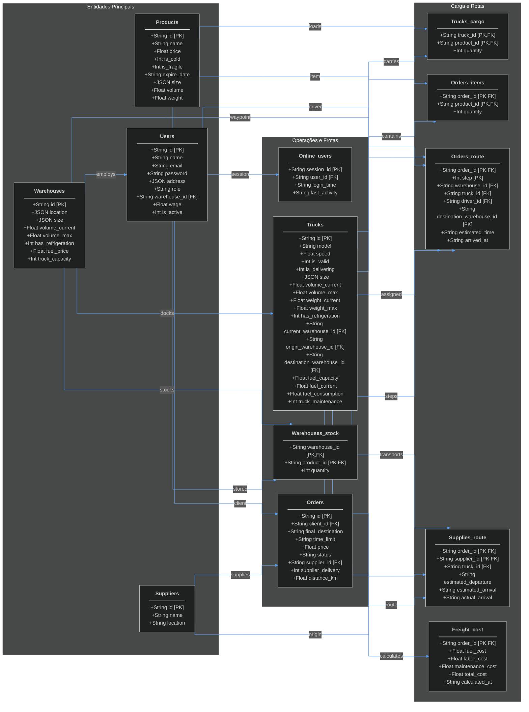

# Modelo de Dados - Projeto de Logística

Abaixo está a representação do modelo de dados em Mermaid com conexões ortogonais e estruturadas:

```mermaid
%%{init: {
  'theme': 'dark',
  'flowchart': {
    'curve': 'stepBefore',
    'nodeSpacing': 45,
    'rankSpacing': 70
  },
  'themeVariables': {
    'darkMode': true,
    'background': '#0d1117',
    'primaryColor': '#161b22',
    'primaryTextColor': '#e6edf3',
    'primaryBorderColor': '#30363d',
    'lineColor': '#58a6ff'
  }
}}%%
flowchart LR

    subgraph Core ["Entidades Principais"]
        USERS["<b>Users</b><hr/>+String id [PK]<br/>+String name<br/>+String email<br/>+String password<br/>+JSON address<br/>+String role<br/>+String warehouse_id [FK]<br/>+Float wage<br/>+Int is_active"]
        PRODUCTS["<b>Products</b><hr/>+String id [PK]<br/>+String name<br/>+Float price<br/>+Int is_cold<br/>+Int is_fragile<br/>+String expire_date<br/>+JSON size<br/>+Float volume<br/>+Float weight"]
        WAREHOUSES["<b>Warehouses</b><hr/>+String id [PK]<br/>+JSON location<br/>+JSON size<br/>+Float volume_current<br/>+Float volume_max<br/>+Int has_refrigeration<br/>+Float fuel_price<br/>+Int truck_capacity"]
        SUPPLIERS["<b>Suppliers</b><hr/>+String id [PK]<br/>+String name<br/>+String location"]
    end

    subgraph Operations ["Operações e Frotas"]
        ONLINE_USERS["<b>Online_users</b><hr/>+String session_id [PK]<br/>+String user_id [FK]<br/>+String login_time<br/>+String last_activity"]
        TRUCKS["<b>Trucks</b><hr/>+String id [PK]<br/>+String model<br/>+Float speed<br/>+Int is_valid<br/>+Int is_delivering<br/>+JSON size<br/>+Float volume_current<br/>+Float volume_max<br/>+Float weight_current<br/>+Float weight_max<br/>+Int has_refrigeration<br/>+String current_warehouse_id [FK]<br/>+String origin_warehouse_id [FK]<br/>+String destination_warehouse_id [FK]<br/>+Float fuel_capacity<br/>+Float fuel_current<br/>+Float fuel_consumption<br/>+Int truck_maintenance"]
        WAREHOUSES_STOCK["<b>Warehouses_stock</b><hr/>+String warehouse_id [PK,FK]<br/>+String product_id [PK,FK]<br/>+Int quantity"]
        ORDERS["<b>Orders</b><hr/>+String id [PK]<br/>+String client_id [FK]<br/>+String final_destination<br/>+String time_limit<br/>+Float price<br/>+String status<br/>+String supplier_id [FK]<br/>+Int supplier_delivery<br/>+Float distance_km"]
    end

    subgraph Logistics ["Carga e Rotas"]
        TRUCKS_CARGO["<b>Trucks_cargo</b><hr/>+String truck_id [PK,FK]<br/>+String product_id [PK,FK]<br/>+Int quantity"]
        ORDERS_ITEMS["<b>Orders_items</b><hr/>+String order_id [PK,FK]<br/>+String product_id [PK,FK]<br/>+Int quantity"]
        ORDERS_ROUTE["<b>Orders_route</b><hr/>+String order_id [PK,FK]<br/>+Int step [PK]<br/>+String warehouse_id [FK]<br/>+String truck_id [FK]<br/>+String driver_id [FK]<br/>+String destination_warehouse_id [FK]<br/>+String estimated_time<br/>+String arrived_at"]
        SUPPLIES_ROUTE["<b>Supplies_route</b><hr/>+String order_id [PK,FK]<br/>+String supplier_id [PK,FK]<br/>+String truck_id [FK]<br/>+String estimated_departure<br/>+String estimated_arrival<br/>+String actual_arrival"]
        FREIGHT_COST["<b>Freight_cost</b><hr/>+String order_id [PK,FK]<br/>+Float fuel_cost<br/>+Float labor_cost<br/>+Float maintenance_cost<br/>+Float total_cost<br/>+String calculated_at"]
    end

    %% Relacionamentos com conexões ortogonais (90 graus)
    USERS -->|session| ONLINE_USERS
    USERS -->|client| ORDERS
    USERS -->|driver| ORDERS_ROUTE
    WAREHOUSES -->|employs| USERS
    WAREHOUSES -->|stocks| WAREHOUSES_STOCK
    WAREHOUSES -->|docks| TRUCKS
    WAREHOUSES -->|waypoint| ORDERS_ROUTE
    PRODUCTS -->|stored| WAREHOUSES_STOCK
    PRODUCTS -->|item| ORDERS_ITEMS
    PRODUCTS -->|loads| TRUCKS_CARGO
    TRUCKS -->|carries| TRUCKS_CARGO
    TRUCKS -->|assigned| ORDERS_ROUTE
    TRUCKS -->|transports| SUPPLIES_ROUTE
    SUPPLIERS -->|supplies| ORDERS
    SUPPLIERS -->|origin| SUPPLIES_ROUTE
    ORDERS -->|contains| ORDERS_ITEMS
    ORDERS -->|steps| ORDERS_ROUTE
    ORDERS -->|route| SUPPLIES_ROUTE
    ORDERS -->|calculates| FREIGHT_COST
```
   
    
   

    
   
   
