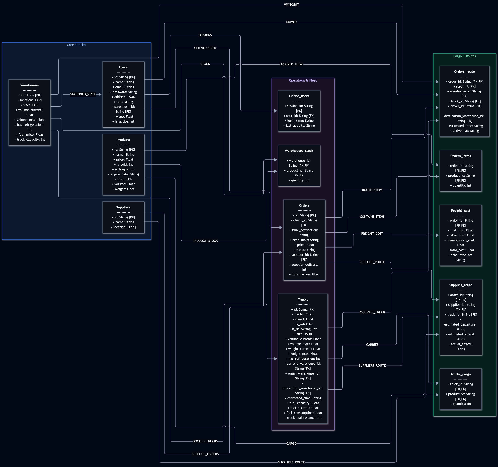
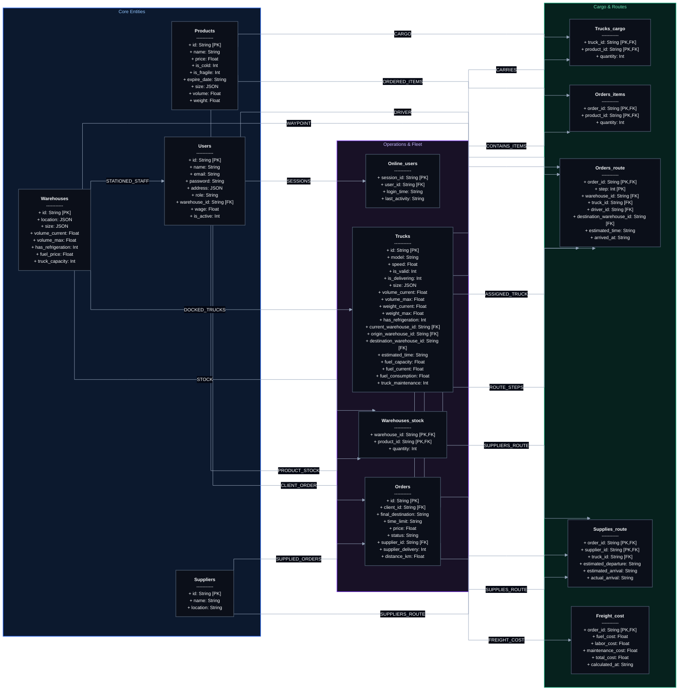
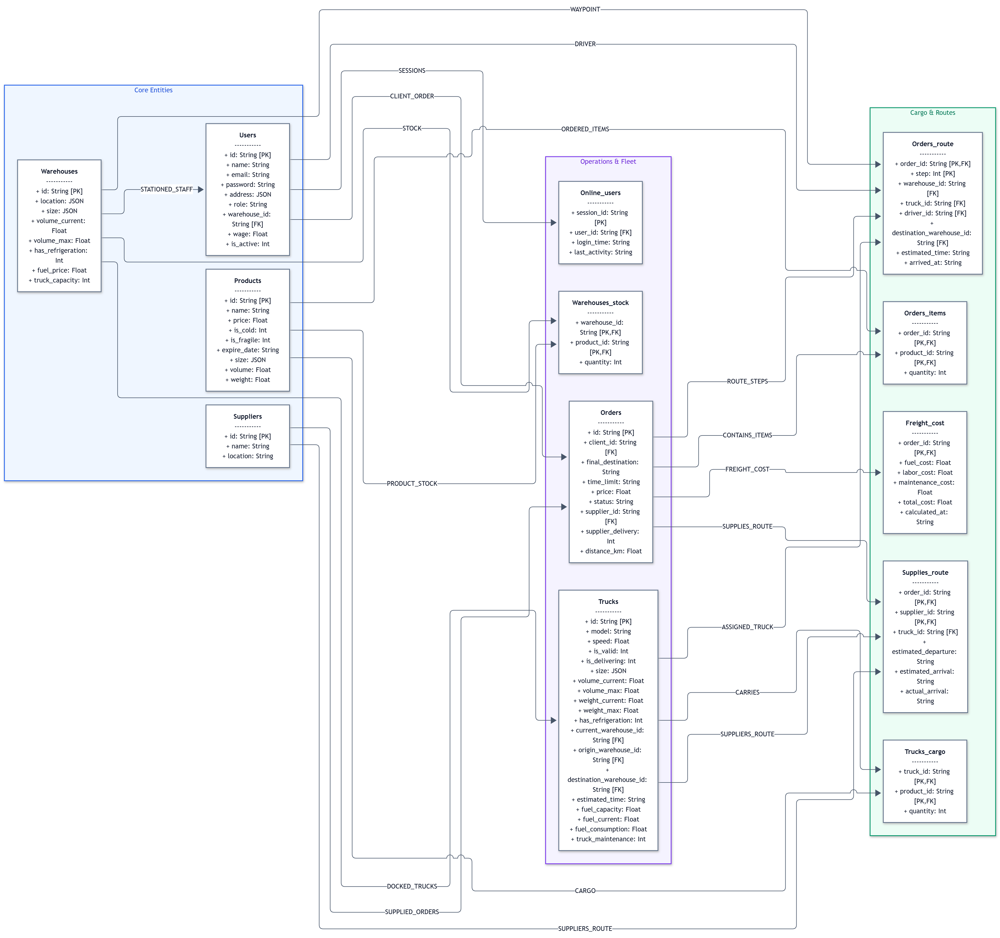

# Data Model - Logistics System

Below are two visualization options for the system data model (Dark Theme and Light Theme), rendered with orthogonal right-angle connections, column alignment, and distinct division container colors.

---

## 1. Dark Theme



<details>
<summary><b>View diagram source code (Dark Theme)</b></summary>


## 2. Light Theme



<details>
<summary><b>View diagram source code (Light Theme)</b></summary>

```mermaid
%%{init: {
  'theme': 'base',
  'flowchart': {
    'curve': 'stepBefore',
    'nodeSpacing': 50,
    'rankSpacing': 80
  },
  'themeVariables': {
    'darkMode': false,
    'background': '#f8fafc',
    'primaryColor': '#ffffff',
    'primaryTextColor': '#0f172a',
    'primaryBorderColor': '#cbd5e1',
    'lineColor': '#475569',
    'textColor': '#0f172a',
    'edgeLabelBackground': '#ffffff',
    'fontSize': '12px'
  }
}}%%
flowchart LR

    classDef default fill:#ffffff,stroke:#64748b,stroke-width:1.5px,color:#0f172a;

    subgraph Core ["Core Entities"]
        USERS["<b>Users</b><br/>-----------<br/>+ id: String [PK]<br/>+ name: String<br/>+ email: String<br/>+ password: String<br/>+ address: JSON<br/>+ role: String<br/>+ warehouse_id: String [FK]<br/>+ wage: Float<br/>+ is_active: Int"]
        PRODUCTS["<b>Products</b><br/>-----------<br/>+ id: String [PK]<br/>+ name: String<br/>+ price: Float<br/>+ is_cold: Int<br/>+ is_fragile: Int<br/>+ expire_date: String<br/>+ size: JSON<br/>+ volume: Float<br/>+ weight: Float"]
        WAREHOUSES["<b>Warehouses</b><br/>-----------<br/>+ id: String [PK]<br/>+ location: JSON<br/>+ size: JSON<br/>+ volume_current: Float<br/>+ volume_max: Float<br/>+ has_refrigeration: Int<br/>+ fuel_price: Float<br/>+ truck_capacity: Int"]
        SUPPLIERS["<b>Suppliers</b><br/>-----------<br/>+ id: String [PK]<br/>+ name: String<br/>+ location: String"]
    end

    subgraph Operations ["Operations & Fleet"]
        ONLINE_USERS["<b>Online_users</b><br/>-----------<br/>+ session_id: String [PK]<br/>+ user_id: String [FK]<br/>+ login_time: String<br/>+ last_activity: String"]
        TRUCKS["<b>Trucks</b><br/>-----------<br/>+ id: String [PK]<br/>+ model: String<br/>+ speed: Float<br/>+ is_valid: Int<br/>+ is_delivering: Int<br/>+ size: JSON<br/>+ volume_current: Float<br/>+ volume_max: Float<br/>+ weight_current: Float<br/>+ weight_max: Float<br/>+ has_refrigeration: Int<br/>+ current_warehouse_id: String [FK]<br/>+ origin_warehouse_id: String [FK]<br/>+ destination_warehouse_id: String [FK]<br/>+ estimated_time: String<br/>+ fuel_capacity: Float<br/>+ fuel_current: Float<br/>+ fuel_consumption: Float<br/>+ truck_maintenance: Int"]
        WAREHOUSES_STOCK["<b>Warehouses_stock</b><br/>-----------<br/>+ warehouse_id: String [PK,FK]<br/>+ product_id: String [PK,FK]<br/>+ quantity: Int"]
        ORDERS["<b>Orders</b><br/>-----------<br/>+ id: String [PK]<br/>+ client_id: String [FK]<br/>+ final_destination: String<br/>+ time_limit: String<br/>+ price: Float<br/>+ status: String<br/>+ supplier_id: String [FK]<br/>+ supplier_delivery: Int<br/>+ distance_km: Float"]
    end

    subgraph Logistics ["Cargo & Routes"]
        TRUCKS_CARGO["<b>Trucks_cargo</b><br/>-----------<br/>+ truck_id: String [PK,FK]<br/>+ product_id: String [PK,FK]<br/>+ quantity: Int"]
        ORDERS_ITEMS["<b>Orders_items</b><br/>-----------<br/>+ order_id: String [PK,FK]<br/>+ product_id: String [PK,FK]<br/>+ quantity: Int"]
        ORDERS_ROUTE["<b>Orders_route</b><br/>-----------<br/>+ order_id: String [PK,FK]<br/>+ step: Int [PK]<br/>+ warehouse_id: String [FK]<br/>+ truck_id: String [FK]<br/>+ driver_id: String [FK]<br/>+ destination_warehouse_id: String [FK]<br/>+ estimated_time: String<br/>+ arrived_at: String"]
        SUPPLIES_ROUTE["<b>Supplies_route</b><br/>-----------<br/>+ order_id: String [PK,FK]<br/>+ supplier_id: String [PK,FK]<br/>+ truck_id: String [FK]<br/>+ estimated_departure: String<br/>+ estimated_arrival: String<br/>+ actual_arrival: String"]
        FREIGHT_COST["<b>Freight_cost</b><br/>-----------<br/>+ order_id: String [PK,FK]<br/>+ fuel_cost: Float<br/>+ labor_cost: Float<br/>+ maintenance_cost: Float<br/>+ total_cost: Float<br/>+ calculated_at: String"]
    end

    style Core fill:#eff6ff,stroke:#2563eb,stroke-width:1.5px,color:#1d4ed8
    style Operations fill:#f5f3ff,stroke:#7c3aed,stroke-width:1.5px,color:#6d28d9
    style Logistics fill:#ecfdf5,stroke:#059669,stroke-width:1.5px,color:#047857

    USERS -->|SESSIONS| ONLINE_USERS
    USERS -->|CLIENT_ORDER| ORDERS
    USERS -->|DRIVER| ORDERS_ROUTE
    WAREHOUSES -->|STATIONED_STAFF| USERS
    WAREHOUSES -->|STOCK| WAREHOUSES_STOCK
    WAREHOUSES -->|DOCKED_TRUCKS| TRUCKS
    WAREHOUSES -->|WAYPOINT| ORDERS_ROUTE
    PRODUCTS -->|PRODUCT_STOCK| WAREHOUSES_STOCK
    PRODUCTS -->|ORDERED_ITEMS| ORDERS_ITEMS
    PRODUCTS -->|CARGO| TRUCKS_CARGO
    TRUCKS -->|CARRIES| TRUCKS_CARGO
    TRUCKS -->|ASSIGNED_TRUCK| ORDERS_ROUTE
    TRUCKS -->|SUPPLIERS_ROUTE| SUPPLIES_ROUTE
    SUPPLIERS -->|SUPPLIED_ORDERS| ORDERS
    SUPPLIERS -->|SUPPLIERS_ROUTE| SUPPLIES_ROUTE
    ORDERS -->|CONTAINS_ITEMS| ORDERS_ITEMS
    ORDERS -->|ROUTE_STEPS| ORDERS_ROUTE
    ORDERS -->|SUPPLIES_ROUTE| SUPPLIES_ROUTE
    ORDERS -->|FREIGHT_COST| FREIGHT_COST
