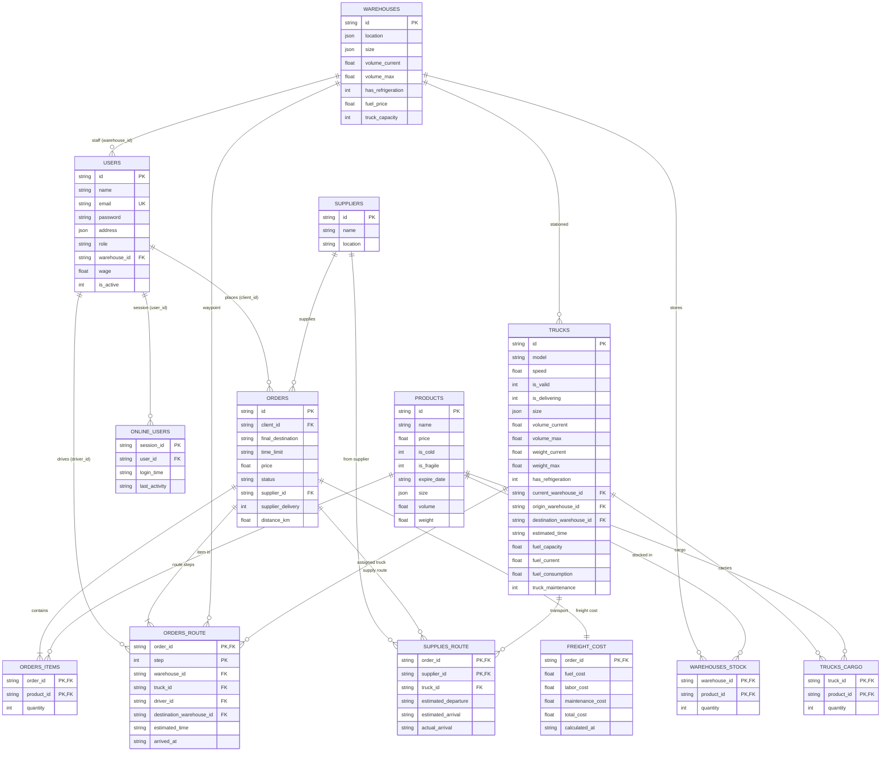
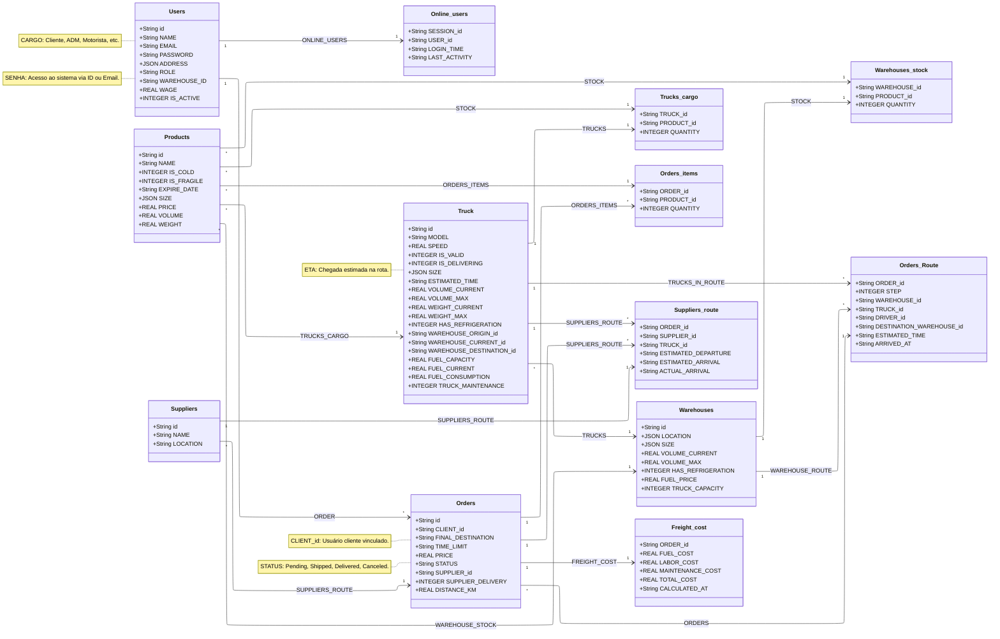

# Modelo de Dados - Projeto de Logística

Abaixo está a representação das classes e relacionamentos do sistema:

# Esquema do Banco de Dados - Projeto Logística

Este diagrama vetorial representa a estrutura de classes e relacionamentos do sistema, incluindo Usuários, Funcionários, Produtos e Logística de Entrega, renderizado com o motor ELK para máxima clareza.

---

## Diagrama Entidade-Relacionamento (ERD) - Renderização Nativa

---

<b>Clique para ver o Diagrama de Classes UML (para edições no Mermaid Live Editor)</b>

    
   
   
    
   

    
   
   
